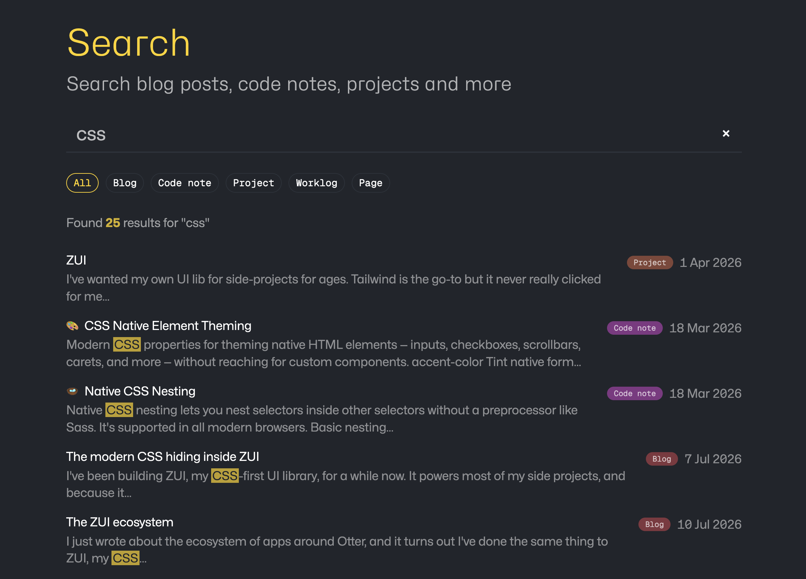

For a while, the search on this site was a bit of an odd duck. My [code notes](/notes) were indexed in Algolia, but nothing else was searchable: not the blog, not my [projects](/projects), not the [worklog](/worklog). Algolia worked fine, but it always felt like a lot of third-party machinery for what is, at heart, a few hundred markdown files. And I had a second itch: I wanted to search my site from [Raycast](https://www.raycast.com/), which means I needed an actual HTTP API, not a JavaScript widget.

So I ripped Algolia out and built my own search on **Cloudflare D1** (Cloudflare's hosted SQLite database) using [FTS5](https://www.sqlite.org/fts5.html), the full-text search engine that ships inside SQLite itself. Now that [Astro is part of Cloudflare](https://astro.build/blog/joining-cloudflare/), this combination feels like it'll only get more first-class over time, and if you already deploy your Astro site to Cloudflare, you have everything you need. The whole thing is agnostic of your content types: anything you can turn into a row of `title + content + url` can be searched.

**TL;DR**

- Build a search index from your content collections at build time, push it to D1 as plain SQL
- One FTS5 virtual table, one Astro server endpoint: `GET /api/search?q=...`
- Results ranked by [bm25](https://en.wikipedia.org/wiki/Okapi_BM25), the standard keyword-relevance scoring algorithm, with per-column weights plus a configurable recency boost
- Free (D1's free tier is far more than a personal site needs), no third-party service, no index shipped to the browser
- Anything that can make an HTTP request can consume it. I built a [Raycast extension](https://github.com/mrmartineau/zander.wtf/tree/main/raycast-extension) that searches the site from my launcher

Everything below links to the real code in [this site's repo](https://github.com/mrmartineau/zander.wtf), so you can steal it wholesale.

---

## Why not Pagefind, Orama or MiniSearch?

Astro has excellent existing options and I considered them: [Pagefind](https://pagefind.app/) indexes your built HTML and lazy-loads index chunks in the browser, [Orama](https://orama.com/) and [MiniSearch](https://github.com/lucaong/minisearch) both give you a proper in-memory search engine as a library. If all you want is a search box on a static site, **use Pagefind**; it's brilliant and needs almost zero setup.

I went a different way for two reasons:

1. **I wanted an API.** Client-side search only exists inside the browser. An endpoint can be hit by the site, a Raycast extension, a CLI, curl: anything. That was the whole point.
2. **I wanted server-side control of ranking.** Column weighting, recency boosts and snippets are all decided in one place, in SQL, and every consumer gets the same results. Tuning the ranking is a config change, not a rebuild of a client bundle.

The trade-off is you need a server runtime. Since this site already runs on Cloudflare with the [`@astrojs/cloudflare` adapter](https://docs.astro.build/en/guides/integrations-guide/cloudflare/), that cost was already paid.

---

## The architecture

```
deploy pipeline
   astro build → deploy to Cloudflare Pages
   └─ then: scripts/build-search-index.ts
        reads content collections + markdown pages
        → generates search-index.sql (full rebuild)
        → wrangler d1 execute --remote --file=search-index.sql

runtime
   GET /api/search?q=...&type=...&limit=...
        Astro endpoint (prerender = false)
        → D1 binding → FTS5 MATCH → bm25 × recency boost + snippet()
        → JSON { results: [{ title, url, type, date, snippet, score }] }

consumers
   site UI (/search)  ·  Raycast extension  ·  anything with fetch
```

One deliberate decision up front: the index is **fully rebuilt on every deploy**. No incremental sync, no triggers, no queues. `DELETE FROM` + batched `INSERT`s. My entire site is ~300 documents; simplicity wins at this scale and honestly at most personal-site scales.

## Step 1: create the database and schema

Everything here uses [Wrangler](https://developers.cloudflare.com/workers/wrangler/), Cloudflare's command-line tool:

```sh
wrangler d1 create my-site-search
```

Next, add a *binding* to `wrangler.toml`. A binding is how Cloudflare exposes a resource (a database, a KV store, a secret) to your code at runtime; this one makes the database available as `env.SEARCH_DB`. If you deploy with `wrangler pages deploy`, adding `pages_build_output_dir` means the binding is configured from this file too, with no dashboard clicking:

```toml
pages_build_output_dir = "./dist"

[[d1_databases]]
binding = "SEARCH_DB"
database_name = "my-site-search"
database_id = "<your-id>"
```

The schema is a single FTS5 *virtual table*, which is a table whose storage and querying are handled by the FTS5 extension rather than by ordinary SQLite ([mine](https://github.com/mrmartineau/zander.wtf/blob/main/migrations/0001_search_index.sql)):

```sql
CREATE VIRTUAL TABLE IF NOT EXISTS search_index USING fts5(
  title,
  description,
  content,
  tags,
  url UNINDEXED,
  site UNINDEXED,
  type UNINDEXED,
  date UNINDEXED,
  emoji UNINDEXED,
  tokenize = 'porter unicode61'
);
```

Two things worth knowing here:

- **`UNINDEXED` columns are stored but not searchable**: free metadata to return with results. This is what makes the system content-type agnostic. `type` is a plain string (`blog`, `note`, `project`, whatever you have), and consumers can filter on it. The `site` column is future-proofing: it would let several sites share one database, with each deploy replacing only its own rows.
- **`porter` stemming** normalises words to their root form, so "deploying" matches "deploy". It's English-only; drop it for multilingual content.

Apply it to both local and remote databases:

```sh
wrangler d1 execute my-site-search --local --file=migrations/0001_search_index.sql
wrangler d1 execute my-site-search --remote --file=migrations/0001_search_index.sql
```

The `--local` copy lives in `.wrangler/state/`, and (this is the nice bit) the Astro dev server can talk to it directly via the adapter's `platformProxy`:

```js
// astro.config.mjs
adapter: cloudflare({
  platformProxy: { enabled: true },
}),
```

## Step 2: build the index

[`scripts/build-search-index.ts`](https://github.com/mrmartineau/zander.wtf/blob/main/scripts/build-search-index.ts) does the whole job: gather documents, convert to plain text, emit SQL, execute it with wrangler.

The gathering step is the only part you'd change for your own site. Each source is a directory glob mapped to a type and a URL pattern:

```ts
for (const file of await mdFilesIn('src/content/blog')) {
  const parsed = await parseFile(file);
  docs.push(toDoc(parsed, 'blog', `/blog/${parsed.slug}`));
}

for (const file of await mdFilesIn('src/content/codenotes')) {
  const parsed = await parseFile(file);
  docs.push(toDoc(parsed, 'note', `/notes/${parsed.slug}`));
}

// ...projects, worklog, even standalone pages like /about and /uses
```

`parseFile` uses [gray-matter](https://github.com/jonschlinkert/gray-matter) and resolves slugs the same way Astro does (frontmatter `slug` wins, else the file/directory name). Keep that logic in one place so your routes and your index can't drift apart.

Markdown is flattened to plain text with a small regex pipeline. One opinion baked in: **I keep the text inside code fences**. My code notes are mostly code; searching for `grid-template` should find them. Strip the fences, keep the contents.

The output is a single SQL file containing a full rebuild:

```sql
DELETE FROM search_index;
INSERT INTO search_index (title, description, content, tags, url, site, type, date, emoji) VALUES
('Building site search with Astro and Cloudflare D1', '...', '...', 'astro cloudflare', '/blog/astro-cloudflare-d1-search', 'zander.wtf', 'blog', '2026-07-21', ''),
-- ...
```

Two gotchas I hit so you don't have to:

1. **SQL escaping.** There's no parameter binding when executing a file, so escaping must be right: double up single quotes (`'` → `''`), and that's genuinely all SQLite needs for string literals. Write one `sqlEscape()` helper and unit test it.
2. **`SQLITE_TOOBIG`.** My first version batched a fixed 40 rows per `INSERT` and immediately blew SQLite's statement size limit, because blog posts are long. Batch by *byte size* instead; I flush each `INSERT` at ~90KB.

Wire it up as package scripts:

```json
"search:index": "tsx scripts/build-search-index.ts",
"search:push": "tsx scripts/build-search-index.ts --target=remote"
```

`search:index` pushes to the local database, so `pnpm search:index` followed by `astro dev` gives you the entire stack (index, endpoint, search page) working offline.

## Step 3: the search endpoint

[`src/pages/api/search.ts`](https://github.com/mrmartineau/zander.wtf/blob/main/src/pages/api/search.ts) is a plain Astro endpoint with `prerender = false`, so it runs on Cloudflare while the rest of the site stays static. The core query (in [`src/utils/search.ts`](https://github.com/mrmartineau/zander.wtf/blob/main/src/utils/search.ts)):

```ts
const { results } = await db
  .prepare(
    `SELECT title, url, type, date, tags, emoji,
       snippet(search_index, 2, '<mark>', '</mark>', '…', 24) AS snippet,
       bm25(search_index, 10.0, 5.0, 1.0, 3.0) AS score
     FROM search_index
     WHERE search_index MATCH ?1
     ORDER BY score
     LIMIT ?2 OFFSET ?3`
  )
  .bind(match, limit, offset)
  .all();
```

- [bm25](https://en.wikipedia.org/wiki/Okapi_BM25) is the ranking function used by most full-text search engines: it scores each row by how often the search terms appear, weighted against how common those terms are across the whole index. FTS5 has it built in, and `bm25()` returns lower-is-better (negative) scores, so `ORDER BY score` ascending is correct. The numbers are per-column weights in table order: title matches count 10×, description 5×, tags 3×, body 1×.
- `snippet()` gives you a highlighted excerpt with `<mark>` tags for free (the `2` is the zero-based index of the column to excerpt from, `content` in my table). Safe to render with `set:html` *only because* the indexed content is my own plain text. If you ever index untrusted content, sanitise the output.

A response looks like this, which is all any consumer needs:

```json
{
  "query": "css grid",
  "results": [
    {
      "title": "CSS Grid",
      "url": "https://zander.wtf/notes/css-grid",
      "type": "note",
      "date": "2023-01-20",
      "tags": "css",
      "emoji": "🍱",
      "snippet": "…display: <mark>grid</mark>; <mark>grid</mark>-template…",
      "score": -7.71
    }
  ]
}
```

### Never let user input reach MATCH raw

FTS5 has its own query syntax (quotes, `AND`, `NEAR()`, `*`, hyphens), and hostile or merely unlucky input will throw syntax errors. Every query goes through a sanitiser first:

```ts
export function toFtsQuery(input: string): string {
  const terms = input
    .replace(/["'`]/g, ' ')
    .split(/\s+/)
    .filter(Boolean)
    .slice(0, 8);
  if (terms.length === 0) return '""';
  return terms
    .map((term, i) => (i === terms.length - 1 ? `"${term}"*` : `"${term}"`))
    .join(' ');
}
```

Quoting each term neutralises every operator; the trailing `*` on the last term gives you prefix matching, which is what makes search-as-you-type feel instant. `curl '/api/search?q=NEAR('` returns an empty result set, not a 500. Unit test this function with the nastiest input you can think of.

## Step 4: ranking, and favouring recent content

Pure bm25 has no idea that my 2012 post about CSS grids (the float kind…) should probably rank below last month's note on the same topic. The fix is a recency multiplier, and because I'll inevitably want to fiddle with it, every knob lives in one config file, [`src/search.config.ts`](https://github.com/mrmartineau/zander.wtf/blob/main/src/search.config.ts):

```ts
export const SEARCH_CONFIG = {
  weights: { title: 10, description: 5, content: 1, tags: 3 },
  recency: {
    boost: 0.35,     // a doc published today gets relevance × 1.35
    windowDays: 1095, // falling linearly to ×1 at 3 years old
  },
  maxTerms: 8,
  snippetTokens: 24,
} as const;
```

In SQL it's one expression, using only core SQLite date functions (no math-extension roulette):

```sql
bm25(search_index, 10.0, 5.0, 1.0, 3.0)
  * (1.0 + 0.35 * coalesce(
      max(0.0, 1.0 - (julianday('now') - julianday(date)) / 1095.0),
      0.0)) AS score
```

Since bm25 scores are negative, multiplying a good match by 1.35 pushes it *up* the list. Undated documents hit the `coalesce` and get no boost. If two documents are equally relevant, the newer one now wins (exactly the behaviour I wanted), but a genuinely better old post still beats a weak new one.

## Step 5: the search page

[`/search`](/search) is a server-rendered Astro page that calls the same `searchIndex()` function directly; there's no reason to fetch your own API over HTTP when you can hit the D1 binding in the frontmatter. It gets type-filter pills (driven by the same `type` column), an empty state showing the latest posts and notes, and a site-wide keyboard shortcut: press <kbd>/</kbd> anywhere on the site. Try it.



The form is a plain GET form, with no client-side JavaScript required:

```html
<form action="/search" method="GET">
  <input type="search" name="q" value={query} />
</form>
```

Rendering the results is where server rendering keeps things pleasingly boring. The page reads the query from the URL, runs the search in the frontmatter, and loops over the rows like any other Astro data. A stripped-down version of [my page](https://github.com/mrmartineau/zander.wtf/blob/main/src/pages/search.astro):

```astro
---
export const prerender = false;

import { searchIndex, type SearchResult } from '~/utils/search';

const query = Astro.url.searchParams.get('q')?.trim() || '';

let results: SearchResult[] = [];
if (query.length >= 2) {
  results = await searchIndex(Astro.locals.runtime.env.SEARCH_DB, {
    query,
    limit: 25,
  });
}
---

{results.map((result) => (
  <article>
    <a href={result.url}>{result.title}</a>
    <span class="type">{result.type}</span>
    {result.date && <time datetime={result.date}>{result.date}</time>}
    {result.snippet && <p set:html={result.snippet} />}
  </article>
))}
```

Two details worth calling out:

- The snippet arrives from the database with `<mark>` tags already wrapped around the matched terms, so `set:html` plus one CSS rule for `mark` gives you highlighted excerpts with zero extra work.
- Because `type` comes back with every row, the filter pills are nothing more than links to the same page with `&type=note` appended. No state, no JavaScript, and the URL is shareable.

### Scoped search: the code notes variant

The site actually has a second search page. The [code notes](/notes) section is its own little world, with a sidebar, tags and a search form of its own, and when you're in there searching, you almost certainly want notes, not blog posts from 2012. So [`/notes/search`](/notes/search) calls the same `searchIndex()` function with `type: 'note'` hard-wired:

```ts
searchResults = await searchIndex(Astro.locals.runtime.env.SEARCH_DB, {
  query,
  limit: 50,
  type: 'note',
});
```

The results render through the notes section's existing list component rather than the generic search layout, so a scoped search looks native to where you're standing: each hit shows its emoji and tags, exactly like the browsable notes index. This is the type-agnostic design paying off a second time. One index and one query function, but each corner of the site can present its own filtered view of it, and a section-scoped search costs one parameter plus whatever rendering that section already has.

## Step 6: automate it in CI

The index should rebuild on every deploy, and **order matters**: deploy the site first, then push the index, so new pages exist before they become searchable. From my [deploy workflow](https://github.com/mrmartineau/zander.wtf/blob/main/.github/workflows/deploy.yml):

```yaml
- name: Build site
  run: pnpm build
- name: Deploy to Cloudflare
  uses: cloudflare/wrangler-action@v3
  with:
    apiToken: ${{ secrets.CLOUDFLARE_API_TOKEN }}
    accountId: ${{ secrets.CLOUDFLARE_ACCOUNT_ID }}
    command: pages deploy dist --project-name=my-site
- name: Update search index (D1)
  run: pnpm search:push
  env:
    CLOUDFLARE_API_TOKEN: ${{ secrets.CLOUDFLARE_API_TOKEN }}
    CLOUDFLARE_ACCOUNT_ID: ${{ secrets.CLOUDFLARE_ACCOUNT_ID }}
```

The only setup outside the repo: your API token needs the **D1 → Edit** permission alongside the usual Pages scope.

## Step 7: the Raycast extension

This is where the API-first decision pays off. The [extension](https://github.com/mrmartineau/zander.wtf/tree/main/raycast-extension) is ~100 lines: a `List` with `useFetch` pointed at the endpoint, a dropdown that sets the `type` param, and search-as-you-type handled by the same prefix matching the site uses:

```tsx
const { data, isLoading } = useFetch<SearchResponse>(
  `${site}/api/search?${params.toString()}`,
  { execute: query.trim().length >= 2, keepPreviousData: true },
);
```

`keepPreviousData` plus the `throttle` prop on `List` gives you a completely smooth typing experience; the server round-trip to Cloudflare's edge is fast enough that it feels local. Enter opens the result in the browser; the whole site is now one keystroke away from anywhere on my Mac.

A search extension for one person's website is of no use to anyone else, so rather than submitting it to the public store I've published it to a private [Raycast organisation](https://developers.raycast.com/teams/getting-started). If you haven't used one before: organisations give you a private extension store, so you get proper installs and updates without the public review process. Handy for exactly this kind of personal tooling.

## Step 8: protect the open endpoint

An open, CORS-anything API on the public internet will eventually get hammered — by a scraper, a misbehaving bot, or someone's curl loop. Nothing here is secret (it's the same data as the public site), so this isn't about auth; it's about making sure abuse costs the abuser more than it costs me. Three cheap layers:

**Bound the cost of a single request.** The endpoint clamps every input: queries over 100 characters are rejected, `limit` is capped at 25 and `offset` at 200. Before the caps, `?offset=999999999` would have made SQLite walk the entire result set on every request — free CPU for anyone who fancied burning it. Cheap to add, and it closes the dumbest attacks outright.

**Cache at the edge.** Every successful response goes into Cloudflare's [Cache API](https://developers.cloudflare.com/workers/runtime-apis/cache/) for five minutes, keyed on a canonicalised URL: query lowercased (FTS5 matching is case-insensitive anyway), params in a fixed order, junk params stripped so they can't be used to bust the cache. Repeated identical queries — which is most of what search-as-you-type produces, and *all* of what replaying the same request produces — get served from the edge without touching D1 or the Function at all.

**Rate limit per IP, at the zone.** This is the one bit that lives outside the repo. Pages Functions don't get the Workers rate-limiting binding, so per-IP limiting happens in the Cloudflare dashboard instead — and conveniently, the free plan includes one WAF rate limiting rule. Under **Security → WAF → Rate limiting rules**, I created a rule matching `(http.request.uri.path eq "/api/search")` that blocks any IP making more than 20 requests in 10 seconds (the period is fixed at 10 seconds on the free plan). It runs at the edge, before the Function is ever invoked, so a flood costs Cloudflare a few rule evaluations and me nothing.

Belt, braces, and a WAF rule. Given D1's free tier allows five million reads a day, this is almost certainly over-engineered for a personal site — but all three layers took under an hour combined, and now I never have to think about it.

---

## Constraints worth knowing

- **The index is briefly empty mid-deploy** (full rebuild = `DELETE` then `INSERT`). At personal-site scale nobody will ever notice; if it bothers you, build into a staging table and rename.
- **Porter stemming is English-only.** Use plain `unicode61` for multilingual sites.
- **The endpoint is open.** It serves the same data as the public site, so beyond the rate limiting and caching above, I don't care. If you would, check a bearer token in the endpoint.
- **D1 free tier** gives you 5GB of storage and 5 million reads a day. My index is about 2MB. I am not going to hit those limits, and neither are you.

The whole system boils down to three parts: a table, a script and an endpoint. None of them care what your content is. Blog posts, recipes, bookmarks, a podcast archive: if it has a title and a URL, it can be a row. If you build one for your own site, [let me know](https://toot.cafe/@zander). I'd love to see it.
