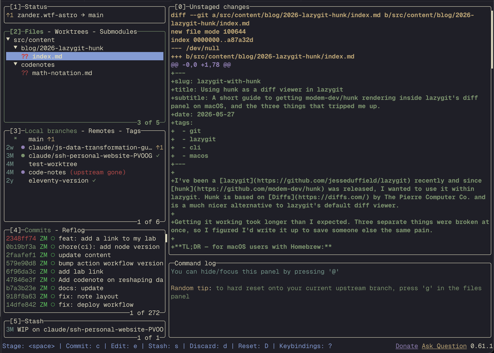
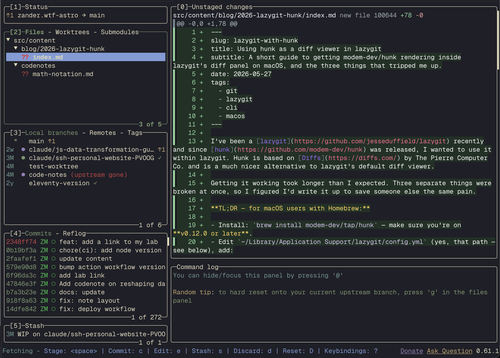

I've been a [lazygit](https://github.com/jesseduffield/lazygit) recently and since [hunk](https://github.com/modem-dev/hunk) was released, I wanted to use it within lazygit. Hunk uses [Diffs](https://diffs.com/) by The Pierre Computer Co. internally and is a much nicer alternative to lazygit's default diff viewer.

Getting it working took longer than I expected. Three separate things were broken at once, so I figured I'd write it up to save someone else the same pain.

**TL;DR — for macOS users with Homebrew:**

- Install: `brew install modem-dev/tap/hunk` — make sure you're on **v0.12.0 or later**.
- Edit `~/Library/Application Support/lazygit/config.yml` (yes, that path — see below), add:

```yml
git:
  pagers:
    - colorArg: always
      pager: hunk pager
```

- Restart lazygit. Done.

### Before



### After



---

## The three things that bit me

### 1. It's `hunk pager`, not `hunk diff`

`hunk diff` is the standalone command — it runs `git diff` itself and renders the result. `hunk pager` is the stdin-reading pager wrapper. lazygit pipes its diff output into whatever pager you configure, so it needs the pager form.

### 2. You need hunk v0.12.0 or later

Earlier versions of hunk assumed an interactive TTY and would either hang or do nothing when launched inside lazygit's captured pager panel. [PR #271](https://github.com/modem-dev/hunk/pull/271) (merged into v0.12.0) added a static-render path: when hunk detects it's running inside a captured-pager host like lazygit, it skips the full TUI and emits a static, fully-coloured diff to stdout instead. Exactly what we want.

If `hunk --version` reports anything older, upgrade first:

```sh
brew upgrade hunk
```

### 3. lazygit on macOS does *not* read `~/.config/lazygit/`

This was the killer. I spent ages editing `~/.config/lazygit/config.yml` and wondering why none of my changes did anything. Turns out lazygit on macOS defaults to `~/Library/Application Support/lazygit/` and ignores `~/.config/lazygit/` unless you set `XDG_CONFIG_HOME=$HOME/.config` in your shell.

You can confirm the path lazygit is actually using:

```sh
lazygit --print-config-dir
```

I prefer keeping all my dotfiles under `~/.config/`, so my fix was to symlink:

```sh
mv "$HOME/Library/Application Support/lazygit/config.yml" \
   "$HOME/Library/Application Support/lazygit/config.yml.bak"
ln -s "$HOME/.config/lazygit/config.yml" \
      "$HOME/Library/Application Support/lazygit/config.yml"
```

Now I can keep editing the file in `~/.config/lazygit/` and lazygit picks it up.

---

## A few caveats

You're getting hunk's **static** renderer inside lazygit, not the full interactive TUI — by design, because lazygit owns the panel. Split-view mode (`--mode split`) isn't honoured in this path yet either; [issue #338](https://github.com/modem-dev/hunk/issues/338) tracks that.

If you want the full interactive hunk TUI for a particular diff, just drop out of lazygit and run `hunk diff` directly in the terminal. Both can coexist happily.

That's it. Three small things stacked on top of each other made this feel a lot harder than it should have been — hopefully this saves someone an afternoon.
